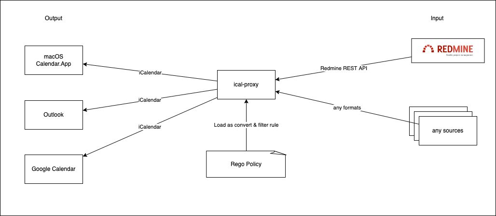

# ical-proxy

A proxy server convert from any sources to [iCalendar](https://datatracker.ietf.org/doc/html/rfc5545) via [OPA/Rego](https://www.openpolicyagent.org/)



## Feature

* Input
  * [x] [Redmine Issue](https://www.redmine.org/projects/redmine/wiki/Rest_Issues)
  * [ ] [Redmine Version](https://www.redmine.org/projects/redmine/wiki/Rest_Versions)
  * [ ] [GitLab issue]()
  * [ ] [GitHub issue]()
  * [ ] [RSS 1.0]()
  * [ ] [RSS 2.0]()
  * [ ] [Atom]()
  * [ ] [External iCalendar]()
  * [ ] [External OPA Server]()
* Output
  * [x] [iCalendar(VEVENT)](https://datatracker.ietf.org/doc/html/rfc5545)

## Usage

* Docker Image is [here](https://github.com/ryodocx/ical-proxy/pkgs/container/ical-proxy)
  * `docker pull ghcr.io/ryodocx/ical-proxy:v1`

```sh
# show help
$ docker run --rm -it ghcr.io/ryodocx/ical-proxy:v1 -h

# edit .env
$ cat .env
ICALPROXY_REDMINE_URL="https://redmine.example.com/path/"
ICALPROXY_REDMINE_APIKEY="<redacted>"
ICALPROXY_REDMINE_QUERY="query_id=xxx"

# edit ./configs/ical.simple.rego

# run
$ docker compose up -d
$ curl http://localhost:8080
```

## Subscribe

* macOS
  * https://support.apple.com/ja-jp/guide/calendar/icl1022/mac
* Outlook
  * https://support.microsoft.com/ja-jp/office/outlook-com-%E3%81%A7%E4%BA%88%E5%AE%9A%E8%A1%A8%E3%82%92%E3%82%A4%E3%83%B3%E3%83%9D%E3%83%BC%E3%83%88%E3%81%BE%E3%81%9F%E3%81%AF%E8%B3%BC%E8%AA%AD%E3%81%99%E3%82%8B-cff1429c-5af6-41ec-a5b4-74f2c278e98c
* Google Calendar
  * https://support.google.com/calendar/answer/37100?hl=ja&co=GENIE.Platform%3DDesktop#:~:text=%E3%83%AA%E3%83%B3%E3%82%AF%E3%82%92%E4%BD%BF%E7%94%A8%E3%81%97%E3%81%A6%E4%B8%80%E8%88%AC%E5%85%AC%E9%96%8B%E3%81%AE%E3%82%AB%E3%83%AC%E3%83%B3%E3%83%80%E3%83%BC%E3%82%92%E8%BF%BD%E5%8A%A0%E3%81%99%E3%82%8B

## Convert & Filtering
* Use [OPA/Rego](https://www.openpolicyagent.org/)
* OPA output is read as single VEVENT
* VEVENT Spec: https://datatracker.ietf.org/doc/html/rfc5545#section-3.6.1
* example: [./configs](./configs/)

expected data after through OPA
```json
{
    "allowed": true, // if false, event is ignored
    "event": {
        "UID": "<UniqID>",
        "SUMMARY": "<title>",
        "DTSTART;VALUE=DATE": "YYYYMMDD"
        ︙
    }
}
```

iCal output example
```ics
BEGIN:VCALENDAR
BEGIN:VEVENT
UID:https://redmine.example.com/issues/1
SUMMARY:subject1
DESCRIPTION:description1
DTSTART;VALUE=DATE:20220717
TRANSP:TRANSPARENT
END:VEVENT
BEGIN:VEVENT
UID:https://redmine.example.com/issues/2
SUMMARY:subject2
DESCRIPTION:description2
DTSTART;VALUE=DATE:20220718
TRANSP:TRANSPARENT
END:VEVENT
END:VCALENDAR
```
