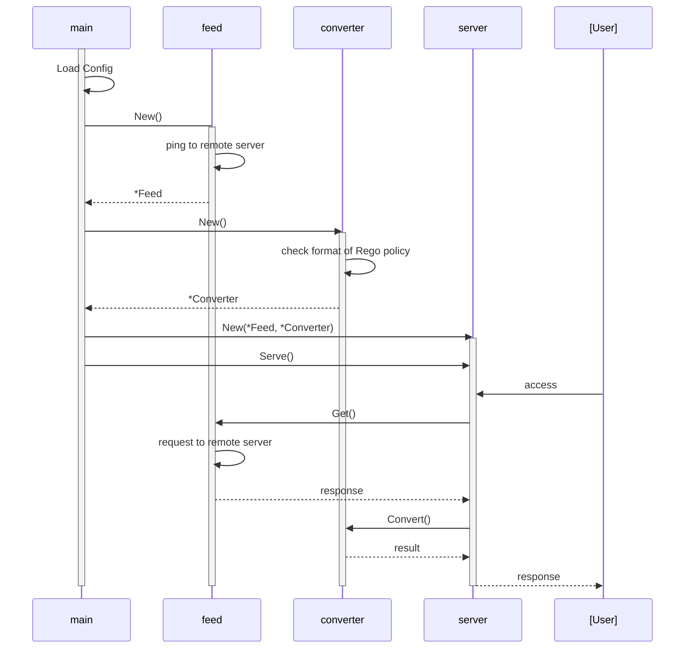

## Feed(Input)
* iCalendar
* RSS 1.0
* RSS 2.0
* Atom
* Redmine
* Common JSON API

## Output
* iCalendar

## Sequence

```mermaid
sequenceDiagram
    activate main
    main ->> main: Load Config

    main -> feed: New()
    activate feed
    feed ->> feed: ping to remote server
    feed -->> main: *Feed

    main ->> converter: New()
    activate converter
    converter ->> converter: check format of Rego policy 
    converter -->> main: *Converter

    main ->> server: New(*Feed, *Converter)
    activate server
    main ->> server: Serve()

    [User] ->> server: access
    server ->> feed: Get()
    feed ->> feed: request to remote server
    feed -->> server: response
    server ->> converter: Convert()
    converter -->> server: result
    server -->> [User]: response
          
    deactivate feed
    deactivate converter
    deactivate server
    deactivate main
```
